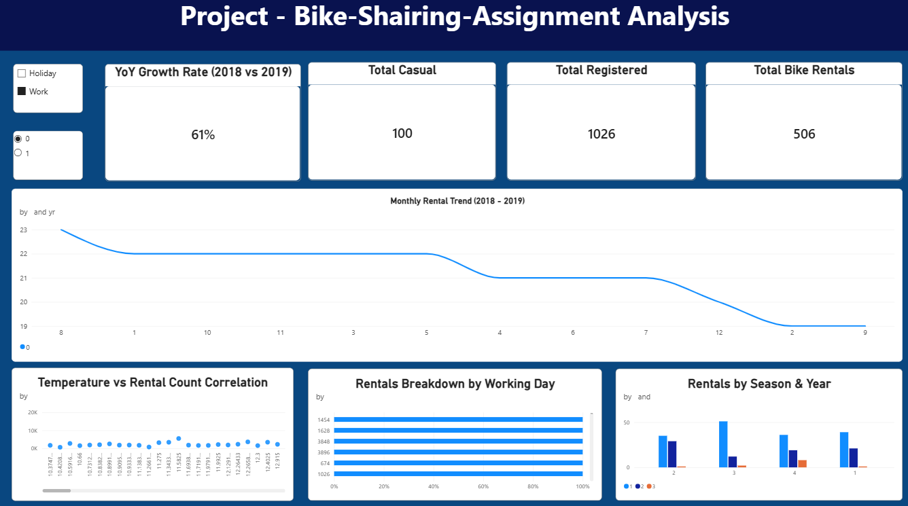

# 🚲 Bike Sharing Data Analysis & Power BI Dashboard

## 📌 Executive Summary
This project presents a comprehensive data analysis and interactive Power BI dashboard analyzing bike-sharing rental patterns, customer behaviors, and environmental factors across 2018 and 2019.

## 📊 Key Insights & Dashboard Features
- **YoY Growth Analysis:** Calculated year-over-year rental performance metrics using custom DAX measures.
- **Trend Identification:** Analyzed monthly variations, working day vs. weekend/holiday patterns, and weather impact on total rentals.
- **Interactive Visuals:** Designed clean visual KPIs, dynamic slicers for filtering, and dark canvas contrast for optimized executive viewing.

## 🛠️ Tools & Technologies Used
- **Python (Pandas & NumPy):** Data cleaning, structure validation, and pre-processing.
- **Power BI Desktop:** Data modeling, DAX measures creation, and visual UI formatting.
- **DAX:** Formulated custom measures for YoY growth and aggregated totals.

## 📸 Dashboard Preview

## 📁 Repository Contents
- `Bike_Sharing_Dashboard.pbix` : Complete Power BI interactive report.
- `data_cleaning.ipynb` : Python/Pandas data cleaning and exploratory analysis notebook.
- `raw_data.csv` : Original bike-sharing dataset.
- `dashboard.png` : High-resolution dashboard screenshot.
